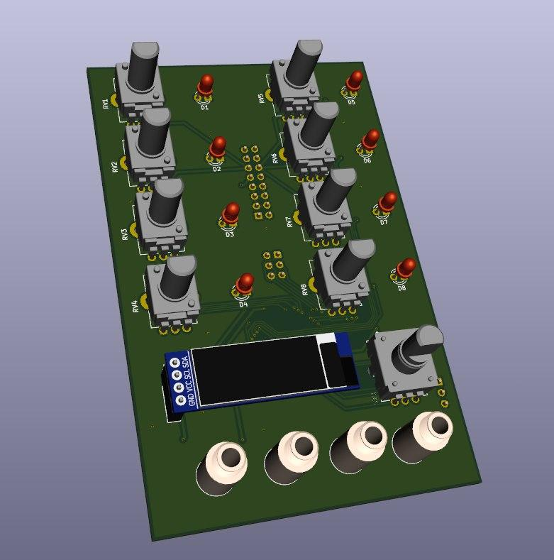

# eurorack_step_sequencer
Open Hardware 8 Channel Eurorack Step Sequencer
# Introduction
These are the KiCad PCB files for a DIY eurorack 8 channel step sequencer module. The heart of the system is an Atmega16A and it features a small i2c OLED Display to modify certain settings. The manufacturing, firmware and testing are still work in progress, photos, videos and firmware will follow.
# 3d Model

